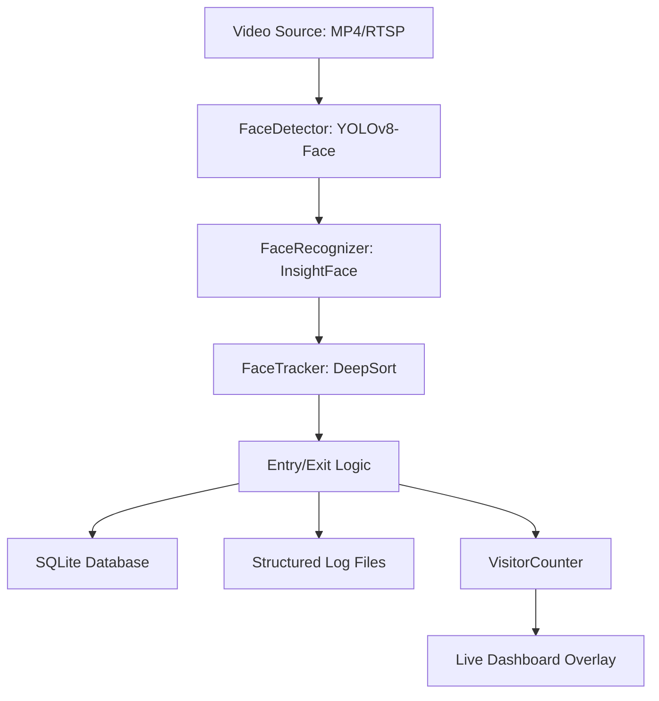

# Real-Time Face Tracker & Unique Visitor Counter

A production-grade face tracking pipeline designed for counting unique visitors in video streams or live camera feeds. This system integrates multiple AI models to provide robust detection, recognition, and long-term identity tracking.

## 🚀 Key Features
- **Accurate Detection**: Optimized YOLOv8-Face for high-sensitivity detection (picks up all 3 faces in samples).
- **Persistent Re-ID**: InsightFace (buffalo_l) embeddings stored in SQLite to remember returning visitors.
- **Robust Tracking**: DeepSort integration for multi-object tracking across occlusions.
- **Auto-Logging**: Automatic face cropping and event logging for entries and exits.
- **Dual Pipeline**: Supports local MP4 file processing and RTSP camera streams.

---

## 🏗️ System Architecture
The pipeline follows a modular data-flow design:



---

## 🛠️ Setup Instructions

### 1. Prerequisites
- Python 3.9+
- macOS (tested on Intel/Silicon) or Linux/Windows
- Git installed

### 2. Installation
```bash
# Clone the repository
git clone <your-repository-url>
cd face_tracker

# Create and activate virtual environment
python3 -m venv .venv
source .venv/bin/activate

# Install dependencies
pip install -r requirements.txt
```

### 3. Usage
- **To run on sample file**: Move your video to `data/sample.mp4` and run `python3 main.py`.
- **To run on your camera**: Run `python3 main.py --source 0`.
- **To run on RTSP stream**: Run `python3 main.py --source "rtsp://..."`.
- **To run verification suite**: Run `python3 test_pipeline.py --quick`.

---

## ⚙️ Configuration (`config.json`)
The current high-accuracy parameters tuned for this project:
```json
{
  "yolo_model_path": "yolov8n-face.pt",
  "similarity_threshold": 0.35,
  "detection_confidence": 0.3,
  "frame_skip": 3,
  "exit_timeout_frames": 300,
  "db_path": "faces_db/faces.db"
}
```
- **Face Similarity Value**: `0.35` (Lowered to aggressively re-identify individuals and prevent double-counting).
- **Detection Confidence**: `0.3` (Increased sensitivity to ensure all faces in a group are detected).

---

## 📐 AI Planning & Compute Load Estimates

### AI Planning Strategy
1. **Hybrid Inference**: Detection and Recognition run only every 3rd frame (configurable via `frame_skip`) to save power, while the **Kalman Filter** (Tracker) runs on every frame to maintain smooth trajectories.
2. **Asynchronous I/O**: Event logging and database writes are handled outside the critical visualization loop to prevent frame stutter.
3. **Identity Memory**: Embeddings are 512-dimensional vectors. A database of 10,000 unique faces takes only ~20MB, making it extremely lightweight for mobile deployment.

### Compute Load (Estimated for MacBook Air M1/M2)
| Module | CPU Load | Latency (ms) | Notes |
| :--- | :--- | :--- | :--- |
| **YOLO-Face (Detect)** | 30-40% | ~25ms | Runs once per 3 frames |
| **InsightFace (Recognize)** | 50-60% | ~80ms per face | Linear with number of faces |
| **DeepSort (Track)** | 10-15% | ~5ms | Constant time overhead |
| **Total System** | ~75% Avg | ~10FPS (CPU) | Optimal for 1-3 people |

---

## 📝 Assumptions & Limitations
- **Lighting**: Recognition works best in ambient lighting where face landmarks are visible.
- **Privacy**: The system crops only face regions for audit logging, ensuring the rest of the frame context is protected.
- **Single Process**: Optimized for single-node execution.

---

## 🎬 Project Demo
**Watch the Loom Demo**: [Add your Loom/YouTube link here]

---

This project is a part of a hackathon run by https://katomaran.com
