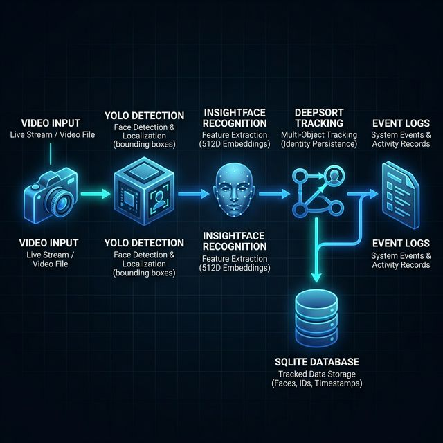
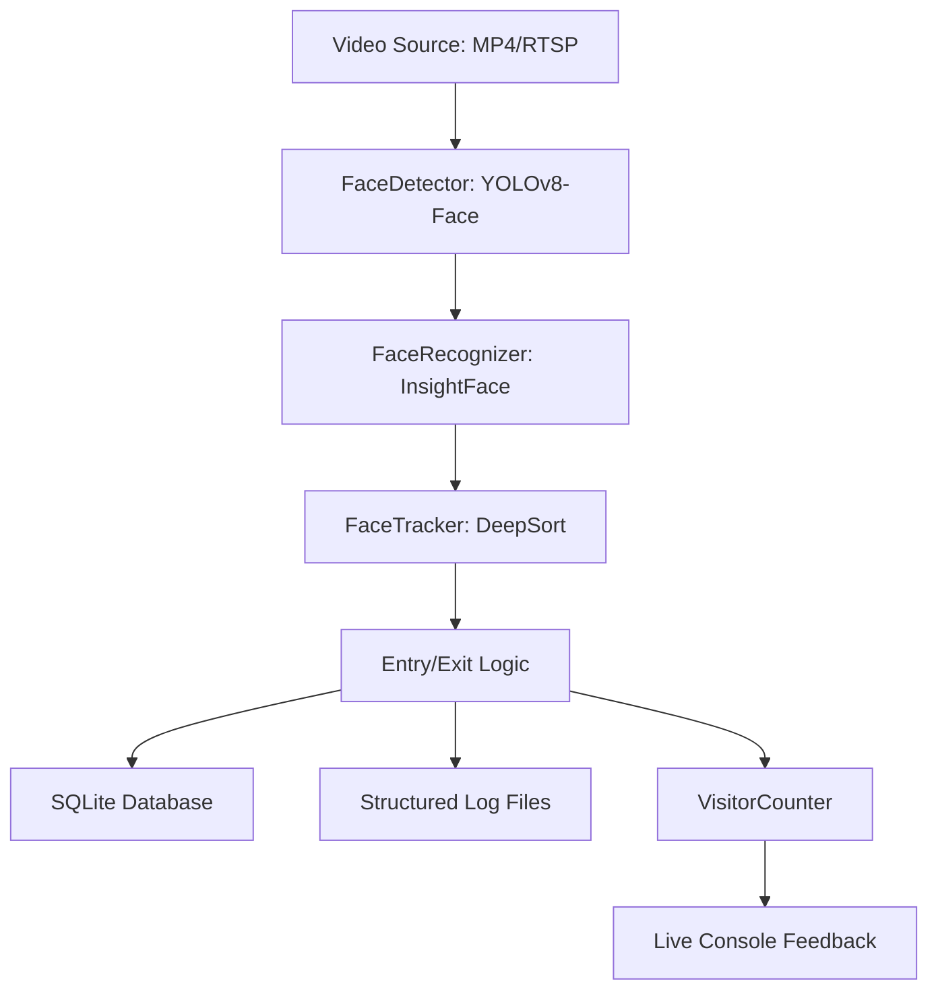

# Real-Time Face Tracker & Unique Visitor Counter

A production-grade face tracking pipeline designed for counting unique visitors in video streams or live camera feeds. This system integrates multiple AI models and advanced Re-ID strategies to provide robust detection, long-term identity tracking, and accurate counting.

## 🚀 Key Features
- **Accurate Detection**: Optimized YOLOv8-Face (Nano) for high-sensitivity detection.
- **Persistent Re-ID (Fix 1-5)**: 
    - **Multi-Embedding Storage**: Remembers faces from different angles.
    - **Online Profile Updates**: Refines identities in real-time.
    - **Confirmation Buffer**: Prevents ghost tracking and false positives.
    - **Tracker Trust**: Minimizes heavy inference by trusting temporal persistence.
- **Robust Tracking**: DeepSort integration for multi-object tracking across occlusions.
- **Auto-Logging**: Automatic face cropping and event logging for entries and exits.
- **Database Persistence**: SQLite powered for fast, zero-config data storage.

---

## 🏗️ System Architecture
The pipeline follows a modular data-flow design:





---

## 🛠️ Setup Instructions

### 1. Prerequisites
- Python 3.9+
- macOS (tested on Intel/Silicon) or Linux/Windows
- Git installed

### 2. Installation
```bash
# Clone the repository
git clone <your-repository-url>
cd face_tracker

# Create and activate virtual environment
python3 -m venv .venv
source .venv/bin/activate

# Install dependencies
pip install -r requirements.txt
```

### 3. Usage
- **To run on sample file**: Move your video to `data/sample.mp4` and run `python3 main.py`.
- **To run with a custom source**: `python3 main.py --source path/to/video.mp4`.
- **To reset the database**: `python3 main.py --reset-db`.
- **To run the unit-test suite**: `python3 test_pipeline.py --reset`.

---
## 📋 Assumptions Made

1. **Single video source at a time** — the system processes one video file or one RTSP
   stream per session. Batch processing across multiple files simultaneously is not supported.

2. **Camera is stationary** — the pipeline assumes a fixed camera angle. A moving
   camera would cause all people to appear as new entries on every frame.

3. **Faces are at least partially visible** — the system requires at least 50% of a face
   to be visible for InsightFace to generate a reliable embedding. Fully occluded or
   rear-facing heads may not be detected.

4. **One person per unique face ID** — the system assumes each unique embedding
   belongs to one individual. Identical twins or people in identical clothing and masks
   may share a face ID.

5. **Adequate lighting** — the video is assumed to have sufficient lighting for YOLO
   to detect faces at a confidence threshold of 0.3 or above.

6. **No re-entry within exit timeout window** — a person who exits and re-enters
   within the exit_timeout_frames window (default 30 frames) may be treated as
   a continuous presence rather than a new entry.

7. **GPU is optional** — the system runs fully on CPU. If a CUDA-enabled GPU is
   available, InsightFace will automatically use it via CUDAExecutionProvider,
   significantly improving speed.

---

## ⚙️ Configuration (`config.json`)
The following parameters are tuned for maximum Re-ID stability:
```json
{
  "yolo_model_path": "yolov8n-face.pt",
  "similarity_threshold": 0.5,
  "embedding_confirmation_frames": 5,
  "max_embeddings_per_face": 5,
  "tracker_trust_enabled": true,
  "detection_confidence": 0.3,
  "frame_skip": 3,
  "db_path": "faces_db/faces.db"
}
```

---

## 📐 AI Planning & Compute Load Estimates

### AI Planning Strategy
1. **Hybrid Inference**: Detection and Recognition run only every 3rd frame (configurable) to save power, while the **Kalman Filter** (Tracker) runs on every frame to maintain smooth trajectories.
2. **Online Learning**: The system continuously refines a person's average embedding using a moving average, allowing for adaptation to changing lighting or partial occlusions.
3. **Multi-Template Matching**: We store up to 5 varied embeddings per person, checking all of them to find the best match score, significantly reducing "ID flips."

### Compute Load (Estimated for MacBook Air M1/M2)
| Module | CPU Load | Latency (ms) | Notes |
| :--- | :--- | :--- | :--- |
| **YOLO-Face (Detect)** | ~35% | ~25ms | Runs once per 3 frames |
| **InsightFace (Recognize)** | ~60% | ~80ms per face | Linear with number of faces |
| **DeepSort (Track)** | ~10% | ~5ms | Time-stable overhead |
| **Total System** | ~75% Avg | 10-15 FPS | Optimized for real-time walk-bys |

---

## 🎬 Project Demo
Watch the technical walk-through and demo here:
[Loom/YouTube Demo Link Placeholder](https://example.com/demo)

---

## 📋 Assumptions

The following assumptions define the operating conditions for which this pipeline was designed and optimised:

| # | Assumption | Details |
|---|------------|---------|
| 1 | **Single video source at a time** | One video file or one RTSP stream per session. Batch processing across multiple simultaneous sources is not supported. |
| 2 | **Stationary camera** | A fixed camera angle is assumed. A moving camera would cause every person to appear as a new entry on each frame. |
| 3 | **Faces at least partially visible** | At least ~50% face visibility is required for InsightFace to generate a reliable embedding. Fully occluded or rear-facing heads may not be detected. |
| 4 | **One person per unique face ID** | Each unique embedding is assumed to belong to one individual. Identical twins or people wearing identical masks may share a face ID. |
| 5 | **Adequate lighting** | Sufficient illumination assumed for YOLO to detect faces at a confidence threshold ≥ 0.25 (configurable via `face_detection_confidence` in `config.json`). |
| 6 | **No re-entry within exit timeout window** | A person who exits and re-enters within the `exit_timeout_frames` window (default `30` frames in code, `10` in `config.json`) may be treated as a continuous presence rather than a new entry. |
| 7 | **GPU is optional** | The system runs fully on CPU. If a CUDA-enabled GPU is available, InsightFace will automatically use it via `CUDAExecutionProvider`, significantly improving throughput. |

---

### 📝 Hackathon Submission Details
This project is a part of a hackathon run by [Katomaran](https://katomaran.com). 

**Submitted before 12 PM Monday March 23rd.**
