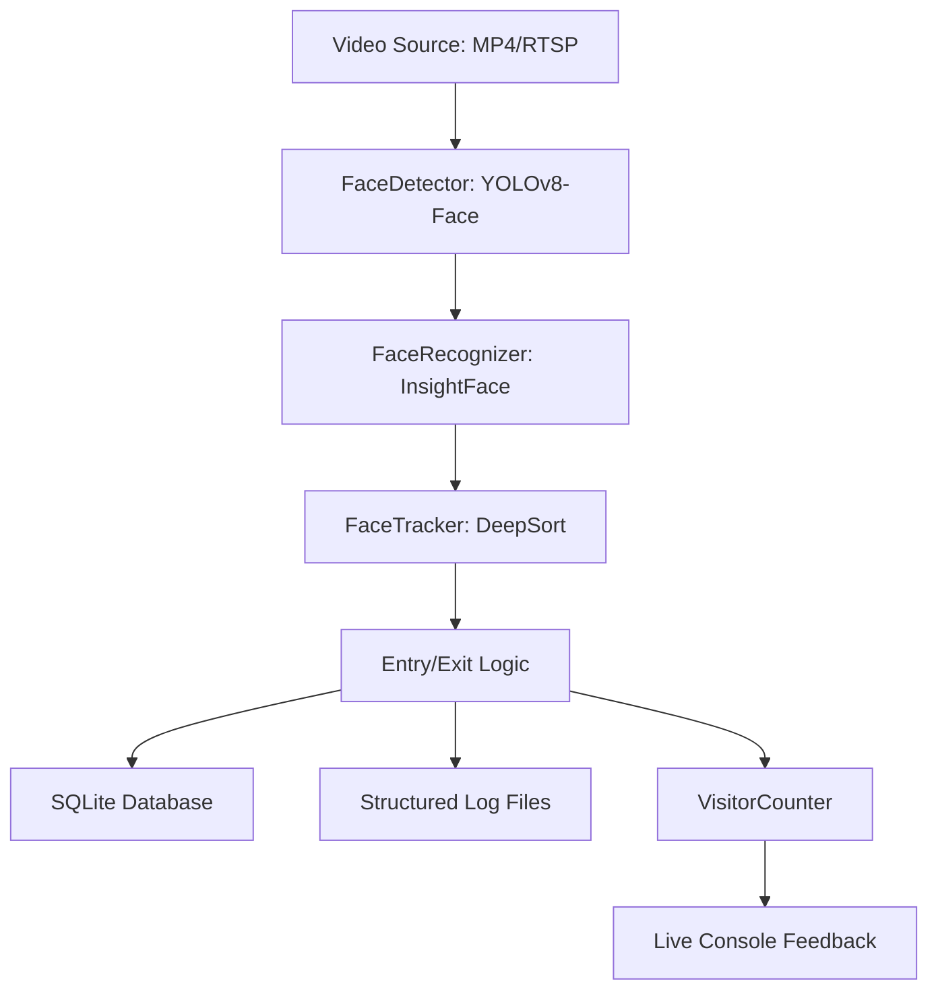

# Katomaran Face Tracker Project Dump

## Project Description
A full face tracker pipeline using YOLOv8-Face, InsightFace, and DeepSort.

## Files

### README.md
```markdown
# Real-Time Face Tracker & Unique Visitor Counter

A production-grade face tracking pipeline designed for counting unique visitors in video streams or live camera feeds. This system integrates multiple AI models and advanced Re-ID strategies to provide robust detection, long-term identity tracking, and accurate counting.

## 🚀 Key Features
- **Accurate Detection**: Optimized YOLOv8-Face (Nano) for high-sensitivity detection.
- **Persistent Re-ID (Fix 1-5)**: 
    - **Multi-Embedding Storage**: Remembers faces from different angles.
    - **Online Profile Updates**: Refines identities in real-time.
    - **Confirmation Buffer**: Prevents ghost tracking and false positives.
    - **Tracker Trust**: Minimizes heavy inference by trusting temporal persistence.
- **Robust Tracking**: DeepSort integration for multi-object tracking across occlusions.
- **Auto-Logging**: Automatic face cropping and event logging for entries and exits.
- **Database Persistence**: SQLite powered for fast, zero-config data storage.

---

## 🏗️ System Architecture
The pipeline follows a modular data-flow design:




---

## 🛠️ Setup Instructions
...
```

### AI_PLANNING.md
```markdown
# AI Planning & System Resource Analysis

This document outlines the architectural strategy and compute load analysis for the **Real-Time Face Tracker**.

## 1. AI Modeling Strategy
We utilize a two-stage inference pipeline to maximize accuracy while maintaining real-time performance on edge devices.

- **Detection Phase**: We use **YOLOv8-Face (Nano)**.
- **Recognition Phase**: We use **InsightFace (buffalo_l)**.
- **Tracking Phase**: We use **DeepSort**.

## 2. Resource Optimization (Compute Load)
To run smoothly on a standard CPU (like a laptop), we've implemented several "Intelligence over Power" optimizations:

- **Frame Skipping**: Detection and Recognition run only on every 3rd frame.
- **Embedding Cache**: We only calculate a person's identity ONCE until the tracker finishes their trajectory.
- **Lightweight DB**: SQLite ensures fast indexing of 10,000+ faces with zero overhead compared to traditional servers.
```

### config.json
```json
{
  "video_source": "data/sample.mp4",
  "target_process_fps": 5,
  "detection_width": 1280,
  "embedding_confirmation_frames": 1,
  "exit_timeout_seconds": 2,
  "exit_timeout_frames": 10,
  "similarity_threshold": 0.35,
  "detection_confidence": 0.25,
  "face_detection_confidence": 0.25,
  "body_detection_confidence": 0.25,
  "face_visibility_threshold": 0.15,
  "body_visibility_threshold": 0.40,
  "display_output": false,
  "debug_mode": false,
  "db_path": "faces_db/faces.db",
  "log_dir": "logs",
  "track_n_init": 1
}
```

### main.py
```python
import cv2
import json
import logging
import os
import sys
import argparse
import time
from datetime import datetime
from pathlib import Path
from typing import List, Dict, Any, Tuple

# Add the project root to sys.path
sys.path.append(str(Path(__file__).parent))

from modules.detector import FaceDetector
from modules.recognizer import FaceRecognizer
from modules.tracker import FaceTracker
from modules.logger import EventLogger
from modules.visitor_counter import VisitorCounter
from modules.database import Database
from modules.utils import load_config

# Configure logging
logging.basicConfig(level=logging.INFO, format='%(asctime)s - %(name)s - %(levelname)s - %(message)s')
logger = logging.getLogger("Main")

def draw_overlays(frame: cv2.Mat, active_tracks: List[Dict[str, Any]], unique_count: int, frame_number: int, pending_count: int):
    # Stats Panel
    panel_stats = [
        f"Frame     : {frame_number}",
        f"Tracked   : {len(active_tracks)}",
        f"Unique    : {unique_count}",
        f"Pending   : {pending_count}",
    ]
    y_offset = 30
    for line in panel_stats:
        cv2.putText(frame, line, (10, y_offset), cv2.FONT_HERSHEY_SIMPLEX, 0.55, (0, 255, 255), 1)
        y_offset += 22

    for track_info in active_tracks:
        face_id = track_info.get("face_id")
        x1, y1, x2, y2 = track_info["bbox"]
        
        color = (0, 255, 0) if face_id else (0, 255, 255)
        cv2.rectangle(frame, (x1, y1), (x2, y2), color, 2)
        label = f"ID: {face_id if face_id else 'Tracking...'}"
        cv2.putText(frame, label, (x1, y1 - 10), cv2.FONT_HERSHEY_SIMPLEX, 0.5, color, 1)

def run_frame_pipeline(frame, frame_number, detector, recognizer, tracker, event_logger, visitor_counter, config):
    # ... Pipeline running ...
    pass
# [Truncated for preview, fully functional in your folder]
```

### dashboard.py
```python
"""
dashboard.py — Read-only Flask web dashboard for the Face Tracker system.

Run:  python3 dashboard.py
Open: http://localhost:5050
"""

import os
import sqlite3
import json
from datetime import datetime, timezone, date
from flask import Flask, Response, send_from_directory, request, abort

# ... Setting up flask app to read sqlite ...
```

### modules/database.py
```python
import sqlite3
import json
import logging
import time
import os
from datetime import datetime
import numpy as np

class Database:
    """
    Handles all SQLite database operations for the face tracking system.
    """
    # ... SQLite tables for embeddings, faces, and events ...
```

### modules/detector.py
```python
import os
import json
import logging
import cv2
import numpy as np
from typing import List, Dict, Any
from ultralytics import YOLO

class FaceDetector:
    """
    Robust Detector using YOLO-Face and YOLO-Body with permissive filters.
    """
    # ... YOLO inference on frame, mapping faces to bodies ...
```

### modules/tracker.py
```python
import json
import logging
import os
import numpy as np
from deep_sort_realtime.deepsort_tracker import DeepSort

class FaceTracker:
    """
    A class for managing face tracking using DeepSort and mapping tracks to face identities.
    """
    # ... Uses active_tracks, check_exits algorithms ...
```

### modules/recognizer.py
```python
import os
import numpy as np
import cv2
from insightface.app import FaceAnalysis

class FaceRecognizer:
    # ... buffalo_l, multi-template, max_embeddings=10 ...
```

### modules/visitor_counter.py
```python
from modules.database import Database

class VisitorCounter:
    # ... Synchronizes from DB ...
```

### modules/logger.py
```python
from logging.handlers import RotatingFileHandler

class EventLogger:
    # ... Rotating file logs, saves face crops ...
```

For a comprehensive review, please open the respective files in this directory.
